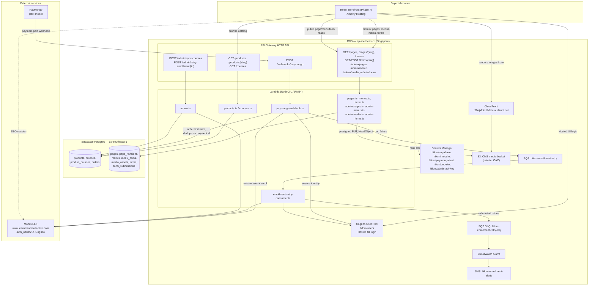

# Hilom Collective

Rebuild of [hilomcollective.com](https://hilomcollective.com) as a custom React commerce
site selling courses hosted on Moodle, with PayMongo checkout and AWS-backed enrollment
automation.

Full phase-by-phase build plan: [docs/hilom-development-plan.md](docs/hilom-development-plan.md).
Project conventions and locked decisions: [CLAUDE.md](CLAUDE.md).

**Status:** Phases 0–8 complete and verified against production. The storefront is
live at **https://www.hilomcollective.com** (Amplify Hosting, connected to this repo's
`main` branch for auto-deploy on push) and at the fallback
`https://main.d2hx75l7mk7woi.amplifyapp.com`. The apex `hilomcollective.com` is mid-cutover
to Amplify — DNS for it still points at the old host pending a manual GoDaddy record swap.

A block-based CMS has also shipped: `/admin` now edits pages, the nav/footer menus, a
media library, and custom forms, with a [Puck](https://puckeditor.com)-powered visual
editor. The five original marketing pages (Home, About, Services, Events, Community) are
seeded into the CMS as **drafts** — `CmsOrFallback` keeps serving the original hardcoded
React pages until each is reviewed and published from `/admin`, so this shipped with zero
visible change to the live site.

---

## Architecture



**Everything lives in `ap-southeast-1` (Singapore)** except the CloudFront/Amplify ACM
certificate, which AWS requires in `us-east-1`. See [CLAUDE.md](CLAUDE.md) for the
full list of hard rules this build follows.

---

## AWS services in use

| Service | Purpose |
|---|---|
| **API Gateway** (HTTP API) | Public + admin REST surface at `api.hilomcollective.com` |
| **Lambda** (Node 24, ARM64) | All backend handlers — catalog reads, admin actions, PayMongo webhook, enrollment retry consumer, CMS pages/menus/media/forms |
| **S3** (CMS media bucket) | Private, uploaded to via presigned PUT from `/admin/media/upload-url`; block-public-access, read only through CloudFront |
| **CloudFront** | Serves CMS-uploaded images from the private media bucket via Origin Access Control — the bucket itself returns 403 on direct access |
| **Cognito** | User pool + Hosted UI; the shared identity between the storefront and Moodle SSO |
| **Secrets Manager** | Every credential (Supabase, Moodle, PayMongo, Cognito app client, admin API key) — nothing secret lives in code, env vars, or the repo |
| **SQS** | `hilom-enrollment-retry` queue + `hilom-enrollment-retry-dlq` dead-letter queue for failed enrollments |
| **SNS** | `hilom-enrollment-alerts` — emails when an order exhausts retries and needs manual attention |
| **CloudWatch** | Logs for every Lambda; alarm on DLQ depth that triggers the SNS alert |
| **ACM** | TLS certs for `api.hilomcollective.com` (ap-southeast-1) and the future storefront domain (us-east-1) |
| **Amplify Hosting** | Serves the React storefront (app `d2hx75l7mk7woi`), connected to this repo's `main` branch (see `amplify.yml`) for auto-deploy on push |
| **EC2** | Used only transiently in Phase 1 (disposable Moodle SSO test box), already terminated |

Outside AWS: **Supabase Postgres** (ap-southeast-1) for the catalog and orders,
**Supabase Storage** (public `course-images` bucket) for mirrored Moodle course images,
**PayMongo** for payment processing, and **Moodle 4.5** (self-hosted, not on AWS) for
course delivery.

---

## Important values

Non-secret identifiers only — every credential lives in Secrets Manager, never here.

| What | Value |
|---|---|
| AWS account | `651706741660` |
| AWS region | `ap-southeast-1` (Singapore) |
| API base URL | `https://api.hilomcollective.com` |
| API execute-api URL (fallback) | `https://n5r99dri26.execute-api.ap-southeast-1.amazonaws.com` |
| Storefront (Amplify) | `https://main.d2hx75l7mk7woi.amplifyapp.com` |
| Amplify app id | `d2hx75l7mk7woi` |
| Cognito user pool | `ap-southeast-1_AA9IeeZ2z` (`hilom-users`) |
| Cognito SPA client (public, PKCE) | `29bo0gpj7j9u7ofbcii22emj8l` (`hilom-web`) |
| Cognito Hosted UI domain | `hilom-auth.auth.ap-southeast-1.amazoncognito.com` |
| Supabase project | `afdhnjohvsoxwzlmpddj` (ap-southeast-1) |
| Supabase pooler host | `aws-0-ap-southeast-1.pooler.supabase.com:5432` |
| Moodle production URL | `https://www.learn.hilomcollective.com` (the `www` is required) |
| Enrollment retry queue | `hilom-enrollment-retry` |
| Enrollment retry DLQ | `hilom-enrollment-retry-dlq` |
| SNS alert topic | `hilom-enrollment-alerts` |
| CMS media bucket | `hilombackendstack-mediabucketbcbb02ba-tw1ga526rpxa` (private; read only via CloudFront) |
| CMS media CDN domain | `https://d3krjxfbid1bdd.cloudfront.net` |

Secrets Manager entries (values never appear in the repo):

| Secret name | Contents |
|---|---|
| `hilom/supabase` | Project URL, publishable key, secret key, DB pooler URL |
| `hilom/moodle` | Web service URL + integration token |
| `hilom/paymongo/test` | Public key, secret key, webhook signing secret |
| `hilom/cognito` | User pool ID, app client ID/secret, Hosted UI domain |
| `hilom/admin-api-key` | Shared key for `/admin/*` routes (CDK-generated) |

Read any of these with:
```bash
aws secretsmanager get-secret-value --region ap-southeast-1 --secret-id <name> --query SecretString --output text
```

---

## Layout

- `frontend/` — React (Vite + TS), deployed via **Amplify Hosting**
  - `src/cms/` — block catalog (`blocks.ts`), renderer (`BlockRenderer.tsx`) shared by both
    the public site and the admin editor's live preview
  - `src/pages/admin/` — admin UI: `PageEditor.tsx` (Puck-based visual editor,
    `puckConfig.tsx` maps the block catalog onto Puck fields), plus Media/Menus/Forms tabs
- `backend/` — Lambda handlers (Node 24 / TS) behind API Gateway, incl. CMS
  (`pages.ts`, `menus.ts`, `forms.ts`, `admin-pages.ts`, `admin-menus.ts`, `admin-media.ts`,
  `admin-forms.ts`) and `lib/cms-blocks.ts` (the block schema + server-side validator)
- `infra/` — AWS CDK (TypeScript) — `HilomBackendStack`
- `db/` — Supabase SQL migrations, RLS policies, seed data (`0006_cms.sql` is the CMS schema)
- `scripts/` — operational scripts (Moodle WS probes, PayMongo test-mode checkout harness,
  `seed-cms.ts` — uploads bundled page images and writes today's copy into the CMS as drafts)
- `docs/` — build plan, SSO/backend/frontend/refund runbooks, the admin runbook, and the facilitator marketplace guide

## Progress

| Phase | Status |
|---|---|
| 0 — Foundations | ✅ done |
| 1 — SSO (Cognito ↔ Moodle) | ✅ done, verified on production |
| 2 — Moodle Web Services | ✅ done, enrollment idempotency confirmed on production |
| 3 — Supabase schema + RLS | ✅ done |
| 4 — API Gateway + Lambda skeleton | ✅ done |
| 5 — Manual course sync | ✅ done (`POST /admin/sync-courses`) — also mirrors course images to Supabase Storage and pulls live enrolled-student counts (`core_enrol_get_enrolled_users`) |
| 6 — Payment + enrollment | ✅ done, verified end-to-end (single course, bundle, forced-failure recovery) against production |
| 7 — Frontend storefront | ✅ done — storefront, on-site checkout, Cognito login, admin panel; live on Amplify |
| 8 — Manual refunds | ✅ done — admin revoke-access, verified incl. the overlapping-products case |
| CMS — page builder | ✅ backend + schema deployed and verified on production (RLS, media pipeline via CloudFront, seed data written as drafts). Pages not yet published — publishing each one from `/admin` is the remaining cutover step |
| 9 — Launch cutover | not started |

## Local development

```bash
npm install                 # installs all three workspaces
cd backend && npm run typecheck
cd infra && npx cdk synth   # apiCertificateArn is pinned in infra/cdk.json — no -c flag needed
```

Runbooks with exact deploy/test commands:
[docs/backend-runbook.md](docs/backend-runbook.md),
[docs/frontend-runbook.md](docs/frontend-runbook.md),
[docs/sso-runbook.md](docs/sso-runbook.md),
[docs/refund-runbook.md](docs/refund-runbook.md).

Operating the admin panel day to day — the queues, the money rules, and the
order operations have to happen in: [docs/admin-runbook.md](docs/admin-runbook.md).
